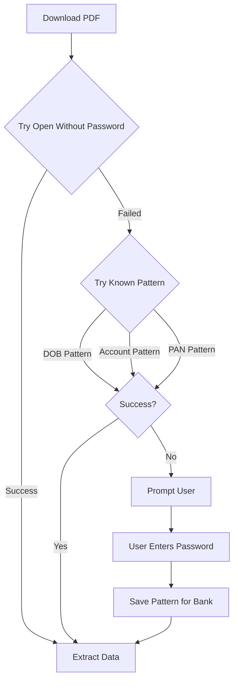

# 🔐 PDF Password Handling & Comprehensive Data Extraction

## 1. Password-Protected PDF Strategy

### **Common Bank Password Patterns**

Most banks use **predictable patterns**:

```dart
// Password Pattern Database
static const bankPasswordPatterns = {
  'Emirates NBD': {
    'pattern': 'DDMMYYYY',  // Date of birth
    'example': '15031990',
    'fallback': 'last4digits', // Last 4 of account
  },
  'ADCB': {
    'pattern': 'YYYYMMDD',
    'example': '19900315',
  },
  'HDFC': {
    'pattern': 'DDMMYY',
    'example': '150390',
  },
  'ICICI': {
    'pattern': 'AccountLast4',
    'example': '1234',
  },
  'Axis': {
    'pattern': 'PAN_Last4',  // PAN card last 4
    'example': 'A123',
  },
};
```

---

### **Password Resolution Flow**



---

### **Implementation**

#### Step 1: Auto-Detect Password
```dart
Future<String?> detectPassword({
  required String bankName,
  required String accountNumber,
  String? dob,
  String? pan,
}) async {
  final pattern = bankPasswordPatterns[bankName];
  if (pattern == null) return null;
  
  switch (pattern['pattern']) {
    case 'DDMMYYYY':
      if (dob != null) {
        // Convert '1990-03-15' → '15031990'
        final date = DateTime.parse(dob);
        return '${date.day.toString().padLeft(2, '0')}'
               '${date.month.toString().padLeft(2, '0')}'
               '${date.year}';
      }
      break;
      
    case 'AccountLast4':
      return accountNumber.substring(accountNumber.length - 4);
      
    case 'PAN_Last4':
      if (pan != null) return pan.substring(pan.length - 4);
      break;
  }
  
  return null;
}
```

#### Step 2: Try Multiple Passwords
```dart
Future<PdfDocument?> openPdfWithFallback({
  required Uint8List pdfBytes,
  required String bankName,
  required String accountNumber,
}) async {
  // 1. Try without password
  try {
    return PdfDocument(inputBytes: pdfBytes);
  } catch (e) {
    // Password required
  }
  
  // 2. Try stored password (from user)
  final storedPwd = await SecureVault.getPdfPassword(bankName);
  if (storedPwd != null) {
    try {
      return PdfDocument(inputBytes: pdfBytes, password: storedPwd);
    } catch (e) {}
  }
  
  // 3. Try pattern-based passwords
  final patterns = await generatePasswordCandidates(bankName);
  for (final pwd in patterns) {
    try {
      final doc = PdfDocument(inputBytes: pdfBytes, password: pwd);
      // Success! Cache this password
      await SecureVault.setPdfPassword(bankName, pwd);
      return doc;
    } catch (e) {
      continue;
    }
  }
  
  // 4. All failed - prompt user
  throw PasswordRequiredException(bankName);
}
```

#### Step 3: User Password Flow
```dart
// In UI when PasswordRequiredException caught
void _handlePasswordRequired(String bankName) async {
  final password = await showDialog<String>(
    context: context,
    builder: (context) => AlertDialog(
      title: Text('PDF Password Required'),
      content: Column(
        mainAxisSize: MainAxisSize.min,
        children: [
          Text('Please enter password for $bankName statements'),
          Text('Usually: DOB (DDMMYYYY) or Account Last 4 digits'),
          TextField(
            obscureText: true,
            decoration: InputDecoration(hintText: 'Password'),
          ),
        ],
      ),
    ),
  );
  
  if (password != null) {
    // Save for future use
    await SecureVault.setPdfPassword(bankName, password);
    // Retry processing
    await processStatement(retryWithPassword: password);
  }
}
```

---

## 2. Investment Statement Handling

### **Types of Investment Statements**

```dart
enum StatementType {
  bankAccount,       // Regular transactions
  creditCard,        // Credit card bills
  demat,             // Share trading
  mutualFund,        // MF statements
  insurance,         // Policy statements
  loanStatement,     // EMI statements
}
```

### **Detection Logic**

```dart
StatementType detectStatementType(String emailSubject, String pdfText) {
  // Check subject line
  if (emailSubject.contains('Demat') || emailSubject.contains('Trading')) {
    return StatementType.demat;
  }
  if (emailSubject.contains('Mutual Fund') || emailSubject.contains('SIP')) {
    return StatementType.mutualFund;
  }
  
  // Check PDF content
  if (pdfText.contains('ISIN') || pdfText.contains('NSE') || pdfText.contains('BSE')) {
    return StatementType.demat;
  }
  if (pdfText.contains('NAV') || pdfText.contains('Folio')) {
    return StatementType.mutualFund;
  }
  if (pdfText.contains('Credit Card') || pdfText.contains('Minimum Due')) {
    return StatementType.creditCard;
  }
  
  return StatementType.bankAccount; // Default
}
```

---

### **Investment-Specific Parsing**

#### Demat/Trading Statements
```dart
Future<List<Investment>> parseDematStatement(String pdfText) async {
  final prompt = '''
Extract stock transactions from this trading statement.
Return JSON array with:
{
  "date": "YYYY-MM-DD",
  "symbol": "TCS.NS",
  "company_name": "Tata Consultancy Services",
  "action": "buy" or "sell",
  "quantity": 10,
  "price": 3500.50,
  "brokerage": 25.00,
  "total_amount": 35030.00,
  "exchange": "NSE" or "BSE"
}

Statement: $pdfText
''';
  
  final result = await geminiService.parseWithPrompt(prompt);
  
  // Convert to app's Investment model
  return result.map((txn) => Investment(
    symbol: txn['symbol'],
    quantity: txn['quantity'],
    purchasePrice: txn['action'] == 'buy' ? txn['price'] : null,
    sellPrice: txn['action'] == 'sell' ? txn['price'] : null,
    purchaseDate: txn['action'] == 'buy' ? txn['date'] : null,
    type: 'stocks',
  )).toList();
}
```

#### Mutual Fund Statements
```dart
Future<List<MutualFund>> parseMutualFundStatement(String pdfText) async {
  final prompt = '''
Extract mutual fund transactions:
{
  "date": "YYYY-MM-DD",
  "fund_name": "HDFC Flexi Cap Fund",
  "folio": "12345678",
  "transaction_type": "purchase" or "redemption" or "sip",
  "amount": 5000.00,
  "nav": 125.50,
  "units": 39.84,
  "balance_units": 500.00
}

Statement: $pdfText
''';
  
  return await geminiService.parseWithPrompt(prompt);
}
```

---

## 3. Comprehensive Data Extraction

### **All Attributes To Extract**

```dart
class ComprehensiveFinancialData {
  // Income
  double? salary;
  double? bonus;
  double? rentalIncome;
  double? dividendIncome;
  double? interestIncome;
  double? capitalGains;
  double? otherIncome;
  
  // Expenses
  Map<String, double> categoryExpenses; // groceries, utilities, etc.
  double? emi;
  double? rent;
  double? insurance;
  double? taxes;
  
  // Investments
  double? sipAmount;
  double? stockPurchases;
  double? mutualFundInvestments;
  double? ppf;
  double? epf;
  double? nps;
  
  // Savings
  double? accountBalance;
  double? fixedDeposits;
  double? recurringDeposits;
  
  // Assets
  double? realEstateValue;
  double? goldValue;
  double? vehicleValue;
  
  // Liabilities
  double? homeLoan;
  double? carLoan;
  double? personalLoan;
  double? creditCardOutstanding;
}
```

---

### **Smart Extraction Prompt**

```dart
final comprehensivePrompt = '''
You are a financial data analyst. Extract ALL financial attributes from this statement.

CRITICAL: Identify transaction types accurately:

INCOME (Positive cash flow):
- Salary deposits (keywords: salary, SAL, income credit)
- Bonus/Incentives
- Rental income (keywords: rent received, rental)
- Dividend income
- Interest earned
- Capital gains from investments
- Refunds

EXPENSES (Negative cash flow):
- EMI payments (car, home, personal loans)
- Rent paid
- Utilities (electricity, water, gas, internet)
- Groceries & food
- Healthcare
- Insurance premiums
- Taxes paid
- Entertainment
- Transportation

INVESTMENTS (Money OUT for wealth building):
- SIP deductions (keywords: SIP, mutual fund)
- Stock purchases
- PPF/EPF contributions
- Fixed deposit creation
- Gold purchases

SAVINGS (Retained in account):
- Opening balance
- Closing balance
- Fixed deposits matured but not withdrawn

Return JSON:
{
  "period": "2024-01",
  "income": {
    "salary": 50000,
    "rental": 5000,
    "dividend": 1200
  },
  "expenses": {
    "rent": 15000,
    "groceries": 8000,
    "utilities": 2000,
    "emi": 12000
  },
  "investments": {
    "sip": 10000,
    "stocks": 5000,
    "ppf": 3000
  },
  "savings": {
    "opening_balance": 100000,
    "closing_balance": 115000
  },
  "assets_detected": {
    "home_value": 5000000,
    "car_value": 800000
  },
  "liabilities_detected": {
    "home_loan": 3500000,
    "car_loan": 400000
  }
}

Statement: $pdfText
''';
```

---

## 4. Auto-Population Logic

### **Database Update Strategy**

```dart
Future<void> autoPopulateFromStatement(
  Map<String, dynamic> extractedData,
  DateTime statementDate,
) async {
  // 1. Populate Transactions
  for (final category in extractedData['expenses'].keys) {
    await repo.insertTransaction(
      TransactionsCompanion(
        date: Value(statementDate),
        type: Value('expense'),
        category: Value(category),
        amount: Value(extractedData['expenses'][category]),
        source: Value('Auto-Email'),
      ),
    );
  }
  
  // 2. Update Income
  if (extractedData['income']['salary'] != null) {
    await repo.insertTransaction(
      TransactionsCompanion(
        date: Value(statementDate),
        type: Value('income'),
        category: Value('salary'),
        amount: Value(extractedData['income']['salary']),
      ),
    );
  }
  
  // 3. Update Investments
  for (final type in extractedData['investments'].keys) {
    await repo.upsertInvestment(
      InvestmentsCompanion(
        type: Value(type),
        amount: Value(extractedData['investments'][type]),
        date: Value(statementDate),
      ),
    );
  }
  
  // 4. Update Account Balance
  await repo.updateAccountBalance(
    balance: extractedData['savings']['closing_balance'],
    asOfDate: statementDate,
  );
  
  // 5. Update Assets
  for (final asset in extractedData['assets_detected'].keys) {
    await repo.upsertAsset(
      AssetsCompanion(
        name: Value(asset),
        currentValue: Value(extractedData['assets_detected'][asset]),
        lastUpdated: Value(statementDate),
      ),
    );
  }
  
  // 6. Update Liabilities  
  for (final liability in extractedData['liabilities_detected'].keys) {
    await repo.upsertLiability(
      LiabilitiesCompanion(
        name: Value(liability),
        currentBalance: Value(extractedData['liabilities_detected'][liability]),
        lastUpdated: Value(statementDate),
      ),
    );
  }
}
```

---

## 5. Complete Workflow Example

**User Journey:**

```
Day 1: Setup
→ User adds email (Gmail)
→ Enables automation
→ System finds 24 bank statements from 2 years

Day 2: First Processing
→ PDF 1: No password needed ✓
→ PDF 2: Tries DOB pattern ✓
→ PDF 3: All patterns fail → Prompts user
→ User enters: "123456" → Saved for HDFC
→ All 24 statements processed

Result After Day 2:
✅ 1,200 bank transactions
✅ 12 investment purchases detected
✅ Salary auto-filled (24 months)
✅ SIP investments tracked
✅ Account balances updated
✅ Assets & Liabilities populated

Day 3 Onwards:
→ Daily auto-sync at 3 AM
→ New statement → Auto-password → Process → Update
→ ZERO manual work!
```

---

## 🎯 Key Advantages

| Feature | Capability |
|---------|-----------|
| **Password Handling** | Pattern-based + User fallback + Caching |
| **Investment Support** | Stocks, MF, Demat, Insurance, Loans |
| **Data Completeness** | Income, Expenses, Investments, Assets, Liabilities |
| **Auto-Population** | 100% automated after setup |
| **Intelligence** | Gemini AI understands context |

**Result:** Complete financial picture with minimal user effort! 🚀
