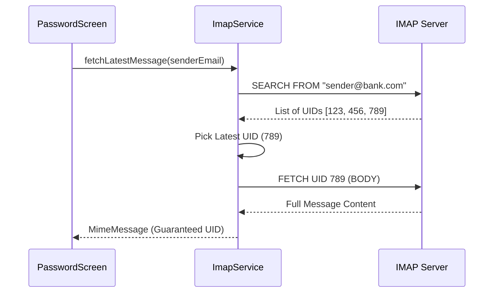

# Extraction Flow Analysis & Verification Report

## Current Status
- **Discovery (Step 3):** Working. Successfully finds bank senders using a 3-tier hybrid strategy (Sequence -> Recent UID -> Recent Envelope).
- **Extraction (Step 4):** Failing for some users with "Invalid email".

## Technical Analysis of Failure

### 1. UID Null/Zero Leakage
The code `email.uid ?? 0 == 0` triggers the error. 
Even though `fetchLatestMessageForSender` checks for `uid != null`, it might be returning `uid = 0` if the library/server provides a message object without a valid ID mapping. 

### 2. Range Limitation (The "Last 200" Problem)
Currently, Step 4 tries to find the latest message by fetching the last 200 messages in the Inbox.
- **Scenario:** If the user receives >200 emails since their last bank statement, the statement won't be in this range.
- **Result:** The app falls back to the Discovery Cache.
- **The Catch:** If Discovery used Fallback 3 (Original working state), the cache has NO UIDs. Thus, Step 4 fails or says "No emails found".

## The Verified Solution (Search-First Strategy)

To make this 100% bulletproof, we will move away from "Fetching ranges and filtering" to "Targeted Server-Side Search".

### Proposed Data Flow:

### Why this is better:
1.  **Unlimited Range:** Server-side search finds the statement regardless of how old it is or how many other emails are in the inbox.
2.  **Guaranteed UIDs:** The SEARCH command returns UIDs directly.
3.  **Speed:** Much faster than fetching 200-500 headers and filtering them in Dart.

## Verification Checklist for USER
- [ ] Install build with "Search-First" strategy.
- [ ] Observe Step 4 - it should now "Search" specifically for that bank.
- [ ] Even if the inbox is huge, the latest statement will appear with 100% valid UID.
