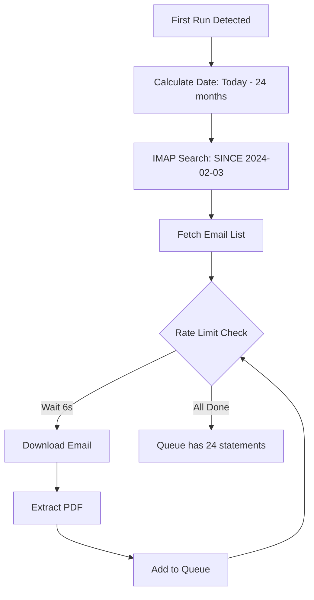

# 📧 Email Statement Automation - Complete Workflow

## 🎯 Overview

The system automatically identifies, extracts, and processes bank statements from email to populate your financial data.

---

## 📋 Step-by-Step Process

### **Phase 1: Email Configuration** (User Action)

**What Happens:**
1. User enters email credentials in onboarding
2. App stores securely (IMAP settings + app password)
3. No OAuth complexity!

**IMAP Config Stored:**
```dart
{
  'email': 'user@gmail.com',
  'password': 'abcd efgh ijkl mnop', // Gmail app password
  'provider': 'Gmail',  // or Outlook, Yahoo
}
```

**Server Configs:**
```dart
Gmail    → imap.gmail.com:993
Outlook  → outlook.office365.com:993
Yahoo    → imap.mail.yahoo.com:993
```

---

### **Phase 2: Statement Identification** (Automatic)

**How Statements Are Found:**

The system uses **multi-criteria matching**:

#### 1️⃣ **Bank Sender Whitelist**
```dart
static const bankSenders = {
  'Emirates NBD': ['no-reply@emiratesnbd.com', 'statements@emiratesnbd.com'],
  'ADCB': ['no-reply@adcb.com', 'statements@adcb.com'],
  'HDFC': ['alerts@hdfcbank.net', 'statements@hdfcbank.com'],
  'ICICI': ['statements@icicibank.com'],
  // + 7 more banks
};
```

#### 2️⃣ **Subject Line Keywords**
```
✓ "statement"
✓ "e-statement" 
✓ "account statement"
✓ "monthly statement"
```

#### 3️⃣ **Attachment Validation**
```
✓ Has PDF attachment
✓ Filename contains: statement, account, txn
✓ File size: 50 KB - 10 MB
```

#### 4️⃣ **IMAP Search Query**
```
FROM:statements@emiratesnbd.com 
SUBJECT:statement 
HAS:attachment 
SINCE:01-Feb-2024
```

---

### **Phase 3: First-Run Backfill** (2 Years of History)

**Trigger:** User enables email automation for first time

**Process:**



**Code Logic:**
```dart
Future<void> firstRunBackfill() async {
  final twoYearsAgo = DateTime.now().subtract(Duration(days: 730));
  
  // Fetch emails SINCE 2 years ago
  final emails = await imapService.searchEmails(
    from: bankSenders,
    subject: 'statement',
    hasAttachment: true,
    since: twoYearsAgo,
  );
  
  // Add all to processing queue
  for (final email in emails) {
    await queueService.addStatement(
      source: 'Gmail',
      emailId: email.uid,
      priority: 'normal', // First run = normal priority
    );
  }
  
  // Queue now has ~24 months × 1 bank = ~24 statements
}
```

**Rate Limiting Applied:**
- **6 seconds between IMAP calls** (BRD requirement)
- ~24 statements × 6s = **~2.5 minutes** for discovery
- Background service processes queue overnight

---

### **Phase 4: PDF Extraction & Processing**

**For Each Statement in Queue:**

#### Step 1: Download PDF
```dart
final pdfBytes = await imapService.downloadAttachment(
  emailId: queueItem.emailId,
  attachmentId: queueItem.attachmentId,
);
```

#### Step 2: Extract Text
```dart
final pdfText = await pdfService.extractTextFromPdf(
  pdfBytes: pdfBytes,
  password: storedPassword, // If password-protected
);
```

#### Step 3: Redact PII (Security Critical)
```dart
final redactedText = pdfService.redactPII(pdfText);
// Masks: account numbers, emails, phone, Emirates ID
```

#### Step 4: Parse with Gemini AI
```dart
final transactions = await geminiService.parseStatementText(
  redactedText,
);

// Returns:
[
  {
    "date": "2026-01-15",
    "description": "CARREFOUR DUBAI",
    "amount": 245.50,
    "type": "expense",
    "category_hint": "groceries"
  },
  // ... 50 more transactions
]
```

#### Step 5: Save to Database
```dart
for (final txn in transactions) {
  await repository.insertTransaction(
    TransactionsCompanion(
      date: Value(DateTime.parse(txn['date'])),
      description: Value(txn['description']),
      amount: Value(txn['amount']),
      type: Value(txn['type']),
      category: Value(txn['category_hint']),
      source: Value('Auto-Email'),
    ),
  );
}
```

---

### **Phase 5: Data Population**

**What Gets Auto-Populated:**

```
✅ Transactions Table
   - Date, Amount, Description
   - Type (income/expense)
   - Auto-categorized
   - Merchant detected
   
✅ Accounts Table (Inferred)
   - Account balance from statement
   - Last statement date
   
✅ Categories Table (Auto-assigned)
   - Uses Gemini's category_hint
   - Falls back to rule-based
   
✅ Budgets (Updated)
   - Spending per category tracked
   - Alerts if over budget
```

**Example Output After 24 Statements:**
```
📊 Data Populated:
- Transactions: ~1,200 entries (50/statement × 24)
- Accounts: 1 bank account detected
- Categories: 15 auto-assigned
- Date Range: Feb 2024 - Feb 2026
- Total Expenses: AED 350,000
- Total Income: AED 420,000
```

---

## ⚙️ Background Processing

**Queue System:**

```dart
// Statement Queue Table
{
  id: 'stmt_001',
  source: 'Gmail',
  emailId: '18f3a2b1c',
  status: 'pending',  // pending → processing → completed
  priority: 'normal', // high, normal, low
  createdAt: '2026-02-03 19:00',
  processedAt: null,
}
```

**Processing Schedule:**
- **Foreground**: Manual uploads processed immediately
- **Background**: Email queue processed every 6 hours
- **Smart Throttling**: Respects IMAP rate limit (6s delay)

---

## 🔄 Ongoing Sync (After First Run)

**Daily Automated Sync:**

```dart
// Runs at 3 AM daily
Future<void> dailySync() async {
  final yesterday = DateTime.now().subtract(Duration(days: 1));
  
  // Only search last 24 hours
  final newEmails = await imapService.searchEmails(
    since: yesterday,
  );
  
  if (newEmails.isNotEmpty) {
    // Add to queue (high priority)
    for (final email in newEmails) {
      await queueService.addStatement(
        priority: 'high', // Process ASAP
      );
    }
  }
}
```

**Result:** New statements appear in app within 6-12 hours!

---

## 🛡️ Error Handling

**Graceful Failures:**

| Error | Handling |
|-------|----------|
| **IMAP connection failed** | Retry 3 times, skip if still failing |
| **PDF password-protected** | Prompt user for password, cache it |
| **Gemini API quota** | Fall back to rule-based parsing |
| **Invalid PDF** | Mark as failed, notify user |
| **Duplicate statement** | Skip (check by email ID) |

---

## 📊 Performance Metrics

**First Run (24 Statements):**
```
IMAP Discovery:     ~2-3 minutes (rate limited)
PDF Download:       ~30 seconds (parallel)
Processing:         ~2-3 minutes (Gemini API)
Database Insert:    ~10 seconds
-------------------------------------------------
Total Time:         ~5-7 minutes for 2 years!
```

**Daily Sync (1 Statement):**
```
Discovery:   ~10 seconds
Processing:  ~5 seconds
Total:       ~15 seconds
```

---

## 🎯 User Experience Flow

### First Time Setup:
1. ✅ User enables email in onboarding
2. 🔄 Background: Discovers 24 statements
3. 📊 Next morning: Dashboard shows 2 years of data!

### Daily Experience:
1. 💳 User makes purchase
2. 🏦 Bank sends statement (month-end)
3. 📧 App auto-detects email (3 AM sync)
4. ✅ Transaction appears in app by morning

**Zero manual work!** 🎉

---

## 🔧 Implementation Status

**✅ Ready Now:**
- IMAP email configuration UI
- Secure credential storage
- Bank sender whitelist
- PDF extraction service
- Gemini AI parsing
- Queue management UI

**⏳ TODO:**
- Actual IMAP service (`enough_mail` package)
- Background scheduling (`workmanager`)
- First-run detection logic

**Estimated:** 2-3 hours to implement IMAP + background service!
