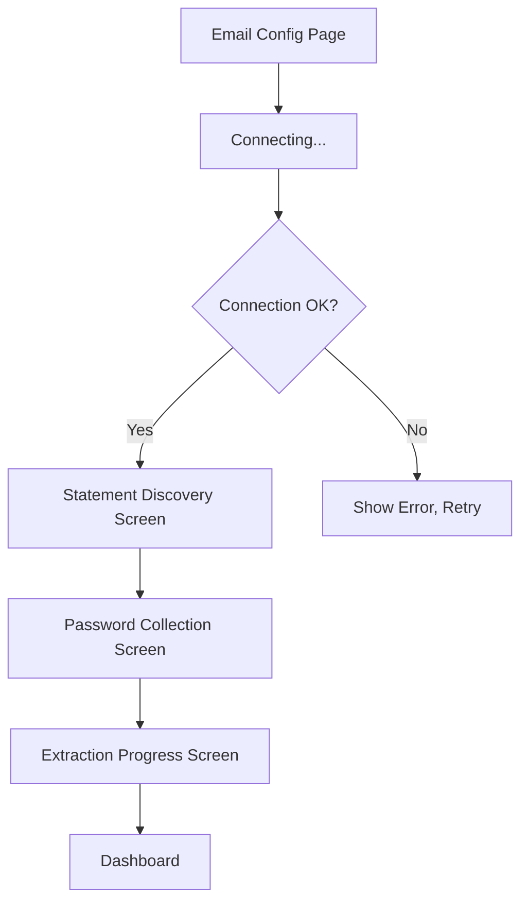

# Implementation Plan: Statement Discovery & Extraction Onboarding

## Overview
After user configures email credentials, implement a multi-step wizard that:
1. Scans inbox for statement emails and groups by sender
2. Shows discovered sources (HDFC, ENBD, Zerodha, etc.) with counts
3. Collects PDF passwords per sender with 5-sample validation
4. Extracts all statements in background, blocking dashboard until complete

---

## Proposed Flow



---

## New Screens

### 1. `StatementDiscoveryScreen`
**Purpose:** Show all identified statement senders from user's inbox

**UI Elements:**
- Header: "We Found Your Statements!"
- List of sender cards, each showing:
  - Bank/Provider logo or icon
  - Sender email (e.g., `estatements@emiratesnbd.com`)
  - Statement count (e.g., "12 statements")
  - Checkbox to include/exclude
- "Continue" button (disabled if no sources selected)

**Logic:**
- Call `ImapService.discoverStatementSenders()` (new method)
- Group emails by sender domain/name
- Auto-detect bank name from sender patterns

---

### 2. `PasswordCollectionScreen`
**Purpose:** Collect PDF passwords for each selected sender

**UI Flow (per sender):**
1. Show sender info + sample statement preview
2. Password input field
3. "Test Password" button
4. Tests on up to 5 PDFs from that sender
5. Shows success/failure count
6. "Next Sender" or "Finish" button

**Logic:**
- Download 5 sample PDF attachments
- Use `syncfusion_flutter_pdf` or `pdf` package to attempt open
- Store validated password in `SecureVault.setPdfPassword(senderId, password)`

---

### 3. `ExtractionProgressScreen`
**Purpose:** Show real-time extraction progress

**UI Elements:**
- Circular progress indicator
- Current sender being processed
- Stats: "23 of 156 statements processed"
- "Do not close the app for faster processing"
- No skip button (user must wait)

**Logic:**
- Process emails sequentially per sender
- Download PDF → Decrypt → Extract text → Send to Gemini → Save transactions
- Update progress state after each statement

---

## New Services

### A. `StatementDiscoveryService`
```dart
class StatementDiscoveryService {
  /// Scan inbox and return unique senders with PDF attachments
  Future<List<DiscoveredSource>> discoverSources(int daysBack) async;
  
  /// Download PDF attachment from email
  Future<Uint8List> downloadAttachment(MimeMessage email, int attachmentIndex) async;
}

class DiscoveredSource {
  final String senderEmail;
  final String senderName; // Extracted/guessed
  final int statementCount;
  final List<MimeMessage> sampleEmails; // First 5 for password testing
  bool isSelected;
}
```

### B. `PdfExtractionService`
```dart
class PdfExtractionService {
  /// Try to open PDF with password, return true if successful
  Future<bool> testPassword(Uint8List pdfBytes, String password) async;
  
  /// Extract text from PDF
  Future<String> extractText(Uint8List pdfBytes, String? password) async;
}
```

---

## Database Updates

### `StatementSources` table updates:
- Add `discoveredAt` DateTime
- Add `lastSyncAt` DateTime
- Add `statementCount` int

### New `ExtractionProgress` table:
```dart
class ExtractionProgress extends Table {
  TextColumn get id => text()();
  TextColumn get sourceId => text()();
  IntColumn get totalStatements => integer()();
  IntColumn get processedStatements => integer()();
  TextColumn get status => text()(); // 'pending', 'processing', 'complete', 'error'
  DateTimeColumn get startedAt => dateTime()();
  DateTimeColumn get completedAt => dateTime().nullable()();
}
```

---

## Implementation Order

### Phase 1: Discovery (This Session)
- [ ] Add `discoverStatementSenders()` to `ImapService`
- [ ] Create `DiscoveredSource` model
- [ ] Create `StatementDiscoveryScreen` UI
- [ ] Wire into onboarding flow after email config

### Phase 2: Password Collection
- [ ] Add `syncfusion_flutter_pdf` dependency
- [ ] Create `PdfExtractionService`
- [ ] Create `PasswordCollectionScreen` UI
- [ ] Implement 5-sample password testing

### Phase 3: Extraction
- [ ] Create `ExtractionProgressScreen` UI
- [ ] Implement background extraction loop
- [ ] Add transaction parsing via Gemini
- [ ] Block dashboard access until complete

---

## Dependencies to Add
```yaml
dependencies:
  syncfusion_flutter_pdf: ^24.1.41  # PDF text extraction
```

---

## User Experience Notes

> [!IMPORTANT]
> User cannot skip to dashboard until extraction is complete. This ensures data integrity.

> [!TIP]  
> Show estimated time remaining based on average processing speed.
